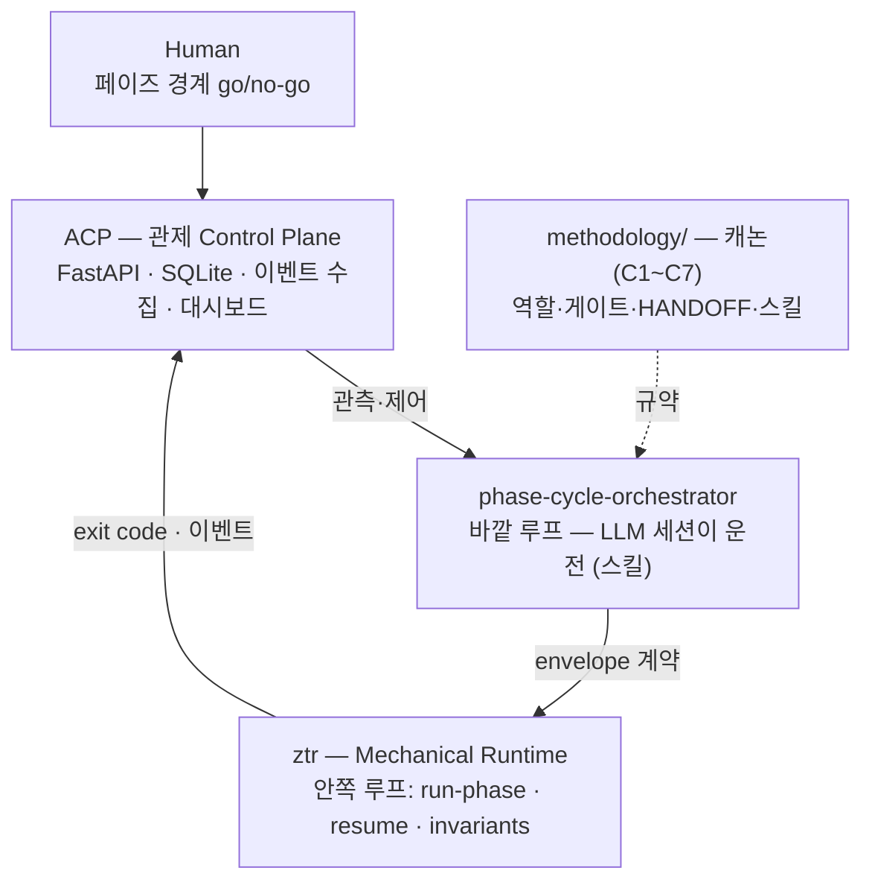

# MultiAgent_Monorepo (MAM) — AI 개발 스위트

> **판단은 LLM 세션이, 기계 검사는 코드가, 인터페이스는 envelope으로, 관제는 사람이 본다.**
> AI 에이전트 협업 방법론(캐논·스킬) + 기계 검사 런타임(ztr) + 관제 control plane(ACP)을
> 계약으로만 결합한 **반자율(semi-autonomous) 개발 스위트**입니다.

**한눈에 보는 결과**

| 항목 | 내용 |
|---|---|
| 구성 | 2층 구성: `methodology/`(캐논·스킬) · `runtimes/{ztr, acp}` — 스위트 결정 문서는 비공개 원본에서 관리 |
| 결합 원칙 | 코드 비융합 — envelope JSON · exit code(0·1·2·124·70) · 이벤트 계약으로만 결합 |
| 자동화 경계 | 안쪽 루프(구현→리뷰→기계 검사) 무인 / 페이즈 경계 3곳(설계 PASS·커밋·다음 페이즈)은 사람 go/no-go |
| 검증 | 실프로젝트 [Model Forge](https://github.com/SangHun-Kimvalue/Model_Forge)에 적용 — 안쪽 루프(구현→기계검사→테스트→리뷰) 4단계 자동 수행, 페이즈 경계는 사람 승인. 독립 리뷰에서 수정 필요 결함 식별 |
| 통합 방식 | 기존 3개 프로젝트의 구조를 단일 워크스페이스로 통합한 공개 스냅샷 |
| 정직성 장치 | PASS vs **NOT CLAIMED**를 방법론이 강제 — 검증된 것과 미검증 부채를 분리 기록 |

## 왜 만들었나 — 실패에서 도출한 경계

전신인 ZTR(다중 AI 합의 코드 리뷰)은 리뷰 시스템으로는 동작했지만,
자율 개발 오케스트레이션으로 확장하는 순간 무너졌습니다. 원인은 두 가지였습니다:
**① 코드가 LLM의 자연어 판단을 파싱해 지휘하려 한 설계 오류**(모델이 바뀔 때마다 파서를 보수하는 하네스 군비경쟁),
**② 상용 GUI 앱 세션에는 트리거를 밀어 넣을 수 없다는 구조적 한계.**

MAM은 이 실패 진단을 불변선으로 코드화한 재설계입니다:

> **R5 — 코드가 파싱하는 LLM 출력은 verdict enum + exit code뿐.**
> 의미 해석·수락/거부·설계 판단은 코드가 하지 않는다.

못 모는 것(상용 GUI 앱)은 관제로 보고(ACP), 몰 수 있는 것(CLI/헤드리스 에이전트)은 구동합니다.

## 아키텍처

## 설계 원칙 (캐논 C1~C7 — 위반 시 리뷰 blocking)

질문 우선(모호하면 착수 전 질문) · 실측(file:line 인용, "관측 없는 경로 = 없는 경로") ·
Fail-fast(조용한 mock/fallback 금지) · 독립 리뷰(자기 구현 자기 승인 금지) ·
YAGNI · 재현성(버전 고정·재현 명령) · 계약 명시(전·후조건 + 실패 목록)

## 정직한 범위 (NOT CLAIMED 포함)

- ✅ 반자율 오케스트레이션 — 안쪽 루프 무인 + 휴먼 게이트
- ✅ 실프로젝트 적용 — [Model Forge](https://github.com/SangHun-Kimvalue/Model_Forge)를 이 스위트로 개발
- ❌ 완전 무인 자율 개발 — 의도적으로 범위 밖 (페이즈 경계는 사람)
- ❌ 정량 시간 절감 주장 — 통제 기준선 부재로 NOT CLAIMED (액션-카운트 수렴만 확인)

## 기술 스택

Python 3.12 · asyncio · Pydantic V2 · SQLite WAL · FastAPI · Claude/Codex/Gemini CLI(헤드리스 구동) · git subtree
