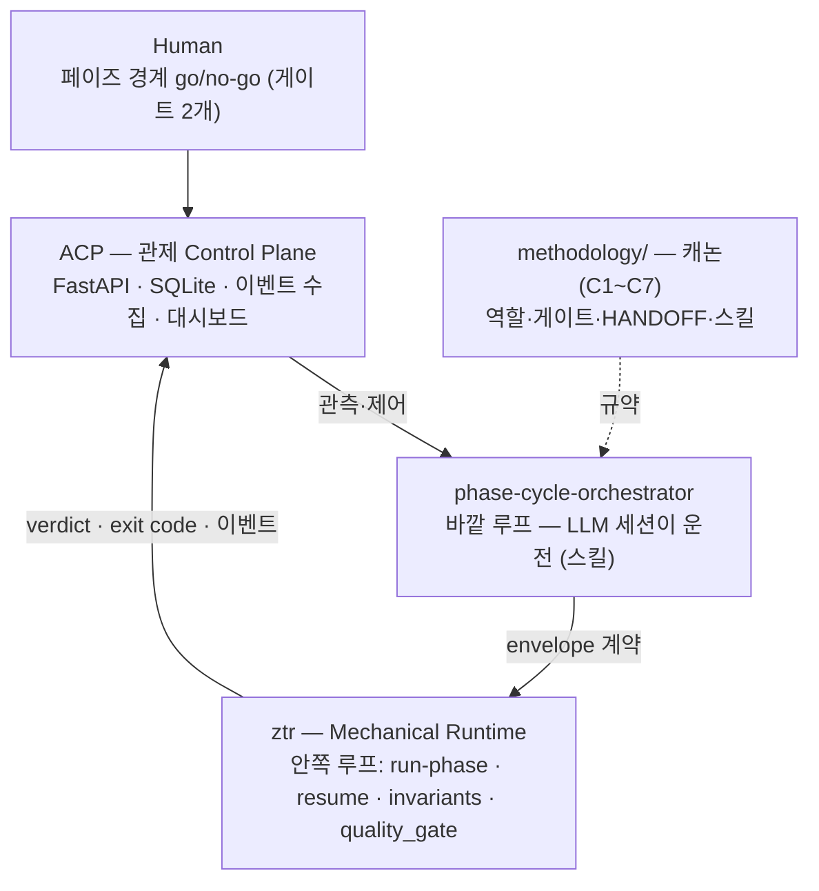

# MultiAgent_Monorepo (MAM) — LLM 출력을 검증 체계로 통제하는 반자율 개발 스위트

> **판단은 LLM 세션이, 기계 검사는 코드가, 인터페이스는 envelope으로, 관제는 사람이 본다.**
> AI 에이전트 협업 방법론(캐논·스킬) + 기계 검사 런타임(ztr) + 관제 control plane(ACP)을
> 계약으로만 결합한 **반자율(semi-autonomous) 개발 스위트**입니다.
> AI가 개발하게 만드는 체계가 아니라, **AI가 만든 것을 함부로 통과시키지 않는 체계**입니다.
> 멀티 에이전트를 쓰는 이유는 분업이 아니라 교차검증 — 서로 다른 계열이 저자의 판정을 반증합니다.

**한눈에 보는 결과**

| 항목 | 내용 |
|---|---|
| 구성 | 2층 구성: `methodology/`(캐논·스킬) · `runtimes/{ztr, acp}` — 스위트 결정 문서는 비공개 원본에서 관리 |
| 결합 원칙 | 코드 비융합 — envelope JSON · exit code(0·1·2·124·70) · 이벤트 계약으로만 결합 |
| 자동화 경계 | 안쪽 루프(구현→기계검사→테스트→리뷰) 4단계 자동 수행 / **휴먼 게이트 2개**(phase start · phase end — 커밋 여부와 다음 페이즈를 각각 승인) |
| 검증 | 구성요소 자동 테스트 **약 1,780개**(ztr 582 · ACP 516 · methodology 684 — 컴포넌트별 최근 full-suite 기록의 합) · [Model Forge](https://github.com/SangHun-Kimvalue/Model_Forge)에 적용해 4-leg 무인 E2E 완주 · 독립 리뷰 게이트가 구현 leg의 실결함(`int(inf)` 크래시 등)을 적발 |
| 통합 방식 | 기존 3개 프로젝트의 구조를 단일 워크스페이스로 통합한 공개 스냅샷 |
| 정직성 장치 | PASS vs **NOT CLAIMED**를 방법론이 강제 — 검증된 것과 미검증 부채를 분리 기록 · 정형 교훈(LESSON) 110건 누적 |

## 왜 만들었나 — 실패에서 도출한 경계

전신인 ZTR(다중 AI 합의 코드 리뷰)은 리뷰 시스템으로는 동작했지만,
자율 개발 오케스트레이션으로 확장하는 순간 무너졌습니다. 원인은 두 가지였습니다:
**① 코드가 LLM의 자연어 판단을 파싱해 지휘하려 한 설계 오류**(모델이 바뀔 때마다 파서를 보수하는 하네스 군비경쟁),
**② 상용 GUI 앱 세션에는 트리거를 밀어 넣을 수 없다는 구조적 한계.**

MAM은 이 실패 진단을 불변선으로 코드화한 재설계입니다:

> **R5 — 코드가 파싱하는 LLM 출력은 verdict enum + exit code뿐.**
> 의미 해석·수락/거부·설계 판단은 코드가 하지 않는다.

못 모는 것(상용 GUI 앱)은 관제로 보고(ACP), 몰 수 있는 것(CLI/헤드리스 에이전트)은 구동합니다.

## 아키텍처

```mermaid
flowchart TD
    H["Human<br/>페이즈 경계 go/no-go (게이트 2개)"] --> ACP["ACP — 관제 Control Plane<br/>FastAPI · SQLite · 이벤트 수집 · 대시보드"]
    ACP -->|관측·제어| ORCH["phase-cycle-orchestrator<br/>바깥 루프 — LLM 세션이 운전 (스킬)"]
    ORCH -->|envelope 계약| ZTR["ztr — Mechanical Runtime<br/>안쪽 루프: run-phase · resume · invariants · quality_gate"]
    ZTR -->|"verdict · exit code · 이벤트"| ACP
    M["methodology/ — 캐논(C1~C7)<br/>역할·게이트·HANDOFF·스킬"] -.규약.-> ORCH
```

## 설계 원칙 (캐논 C1~C7 — 위반 시 리뷰 blocking)

질문 우선(모호하면 착수 전 질문) · 실측(file:line 인용, "관측 없는 경로 = 없는 경로") ·
Fail-fast(조용한 mock/fallback 금지) · 독립 리뷰(자기 구현 자기 승인 금지) ·
YAGNI · 재현성(버전 고정·재현 명령) · 계약 명시(전·후조건 + 실패 목록)

## 2026-08 확장 — AI 리뷰 루프를 "자원 관리 문제"로

런타임을 더 만드는 대신, **리뷰 루프 자체를 계량·집행 가능한 자원으로** 다뤘습니다. C++ 시스템에서 늘 쓰던 자원 상한·타임아웃·상태 원장·fail-closed 사고를 비결정론적 LLM 파이프라인에 이식한 구간입니다.

- **리뷰 예산 → fail-closed 집행** — 구현 diff 축과 문서 축을 분리한 등급별 라운드 상한. 카운터의 단일 출처는 phase 문서의 `review-budget` fenced block, 잠금→재검증→내구 저장→해제→Reviewer 순서 고정. 축 카운터가 없으면 fail-closed
- **verdict 스키마 2.0** — required 19필드. `budget_limit`은 문서 신고값을 믿지 않고 등급에서 파생 대조(예산 위조 탐지). 1.0은 감사용 동결
- **컨텍스트 hard cap** — dispatch 전 control bundle 12,000자, leg별 diff/hunk 40,000자. 재리뷰는 미해결 finding + disposition + 이번 hunk만 전달
- **목적 원장(Goal/Intent Ledger)** — 선언한 목적과 실제 산출의 대응을 기계 검증하는 append-only 원장. 독립 검사기와 writer를 별도 커밋·독립 리뷰로 분리
- **leg별 타임아웃·감사 계약** — 5개 leg에 optional timeout 대칭 배선(`leg override > global > 600s`), 장시간 leg 하나가 전체 런을 잠그는 구조 제거
- **관측 정직성** — "관측하지 않은 것을 관측한 것처럼 보이지 않게": 상태 어휘 단일 출처, 실행 증거를 capability/observation 2축 분리, mutation 테스트 89건으로 게이트 유효성 실증

## 정직한 범위 (NOT CLAIMED 포함)

- ✅ 반자율 오케스트레이션 — 안쪽 루프 자동 수행 + 페이즈 경계 사람 승인(게이트 2개)
- ✅ 실프로젝트 적용 — [Model Forge](https://github.com/SangHun-Kimvalue/Model_Forge)를 이 스위트로 개발, 독립 리뷰가 타 leg가 놓친 결함을 적발한 장면을 라이브로 확인
- ❌ 완전 무인 자율 개발 — 의도적으로 범위 밖 (페이즈 경계는 사람)
- ❌ 정량 시간·토큰 절감 주장 — 통제 기준선 부재로 NOT CLAIMED (액션-카운트 수렴만 확인)
- ❌ 테스트 합계 1,780은 컴포넌트별 **서로 다른 시점** full-suite 기록의 합 — 동시 재실행본 아님
- ❌ circuit_breaker(반복 실패 차단) 발동은 미실증
- ❌ 리뷰 예산 preflight는 **막지 못하는 우회 2가지(축 재분류·잠금 무시 writer)를 스스로 문서화** — "완전 집행"이라 하지 않음

## 기술 스택

Python 3.12 · asyncio · Pydantic V2 · SQLite WAL · FastAPI · Claude/Codex/Gemini CLI(헤드리스 구동) · git subtree · pytest
